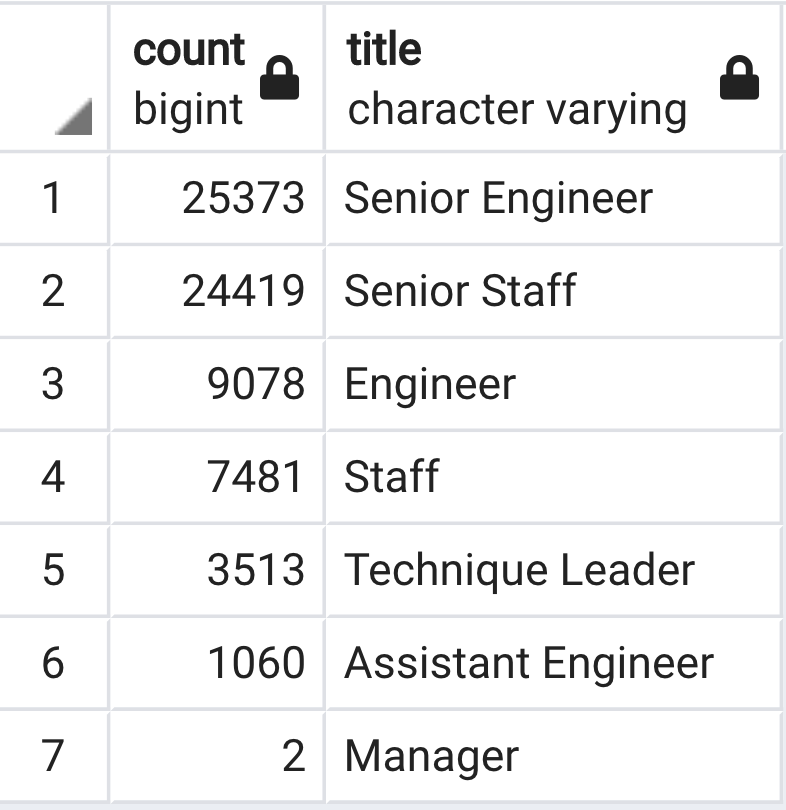

# Pewlett_Hackard_Analysis

## Project Overview:
The purpose of this analysis was to use PostgreSQL to create databases from hypothetical Pewlett Hackard data and extract relevant information that could inform business decisions. When exploring the data I found that there appeared to be a large number of employees that might be retiring soon. So, I decided to focus my analysis on determining exactly how many employees would be eligible for retirement and which of these employees would be eligible for a mentorship program designed to pass on valuable skills from experienced workers to new recruits.

## Approach:

- Created a schema to quickly load data into PostgreSQL database 
- Created queries to determine the number of employees retiring based on their title
- Created queries to determine the number of employees that would be eligible for the new mentorship program

## Resources
[schema.sql](schema.sql) - Contains queries used to create the relational databases used in this analysis.

[Employee_Database_challenge.sql](Employee_Database_challenge.sql) - Contains the queries to generate tables that indicate (1) a list of all retirees based on their title, (2) the total number of unique retirees by their title, (3) potential retirees that would be eligible to transition from full time work into the part-time work / mentorship program.

## Results
- This analysis indicates that Pewlett Hackard has 70,920 employees who will be eligible for retirement.

- Most of the potential retirees are individuals that hold Senior Engineer and Senior Staff positions (see figure below).

- In addition, many individuals with Engineer and Staff positions are also eligible for retirement (see figure below).

- There are 1,549 individuals currently eliglble for the part time work / mentorship program.

## Summary
The results of this dataset indicate that Pewlett Hackard is facing a serious number of retirements that will occur in the coming years. The loss of 70,920 employees, especially those that hold senior positions, could be devastating for productivity of the business. Therefore, initating a program where potential retirees could instead transfer to part-time work and act as mentors for existing and new recruits would likely be highly beneficial. 